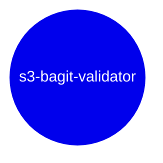

# s3-bagit-validator

AWS Lambda to validate a [Bagit](https://www.ietf.org/rfc/rfc8493.txt) bag stored in S3.

## Development

- To preview a list of available Makefile commands: `make help`
- To install with dev dependencies: `make install`
- To update dependencies: `make update`
- To run unit tests: `make test`
- To lint the repo: `make lint`

## Running Locally with Docker

<https://docs.aws.amazon.com/lambda/latest/dg/images-test.html>

- Build the container:

  ```bash
  docker build -t validator:latest .
  ```

- Run the default handler for the container:

  ```bash
  docker run -e WORKSPACE=dev -p 9000:8080 validator:latest
  ```

- Post to the container:

  ```bash
  curl -XPOST "http://localhost:9000/2015-03-31/functions/function/invocations" -d '{}'
  ```

- Observe output:

  ```
  "You have successfully called this lambda!"
  ```

## Running a Specific Handler Locally with Docker

If this repo contains multiple lambda functions, you can call any handler you copy into the container (see Dockerfile) by name as part of the `docker run` command:

```bash
docker run -p 9000:8080 validator:latest lambdas.<a-different-module>.lambda_handler
```

## Environment Variables

### Required

```shell
SENTRY_DSN=### If set to a valid Sentry DSN, enables Sentry exception monitoring. This is not needed for local development.
WORKSPACE=### Set to `dev` for local development, this will be set to `stage` and `prod` in those environments by Terraform.
```

## Related Assets

* Infrastructure: TODO



## Maintainers

* Team: [DataEng](https://github.com/orgs/MITLibraries/teams/dataeng)
* Last Maintenance: 2025-03