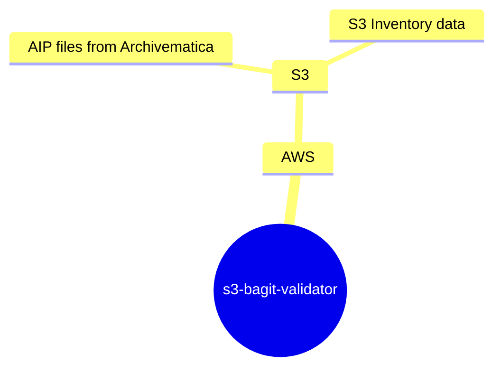

# s3-bagit-validator

AWS Lambda to validate a [Bagit](https://www.ietf.org/rfc/rfc8493.txt) bag stored in S3.

## Development

- To preview a list of available Makefile commands: `make help`
- To install with dev dependencies: `make install`
- To update dependencies: `make update`
- To run unit tests: `make test`
- To lint the repo: `make lint`

### Running Locally with Docker

See [instructions for running via AWS SAM CLI here](tests/sam/README.md).

## Lambda Request / Response Payloads

This AWS Lambda is primarily invoked via a `POST` HTTP request.  The following outline the request and response payloads. 

### Request Payload

- `action`
  - action for the lambda to perform
  - allowed values: `[validate, ping]`
- `aip_uuid`
  - UUID of the AIP to validate
- `challenge_secret`
  - lightweight authorization string known by requester and Lambda
- `verbose`
  - boolean for verbose logs

#### Example: `validate` by passing AIP UUID
```json
{
    "action":"validate",
    "aip_uuid":"29d47878-a513-475a-bd1d-ffabd1026e24",
    "challenge_secret":"totally-local-s3-bagit-validating",
    "verbose":false
}
```

#### Example: `validate` by passing AIP S3 URI
```json
{
    "action":"validate",
    "aip_s3_uri":"s3://my-aips-bucket/29d4/7878/a513/475a/bd1d/ffab/d102/6e24/testdev_aipstore4-29d47878-a513-475a-bd1d-ffabd1026e24",
    "challenge_secret":"totally-local-s3-bagit-validating",
    "verbose":false
}
```

### Response Payload

#### Example: Valid AIP

```json
{
    "bucket": "cdps-storage-dev-222053980223-aipstore4b",
    "aip_uuid": "29d47878-a513-475a-bd1d-ffabd1026e24",
    "aip_s3_uri": "s3://my-aips-bucket/29d4/7878/a513/475a/bd1d/ffab/d102/6e24/testdev_aipstore4-29d47878-a513-475a-bd1d-ffabd1026e24",
    "valid": true,
    "elapsed": 2.1,
    "error": null,
    "error_details": null
}
```
- `bucket`, `aip_uuid`, and `aip_s3_uri` are always returned, regardless of UUID or S3 URI that was provided as input for validation
- `error` and `error_details` are null when the AIP is valid, otherwise they contain all known validation error information

## Command Line Interface (CLI)

This application includes a CLI that is designed to invoke the deployed AWS Lambda.  This supports running AIP validation from a command line context, while still utilizing all the wiring and permissions of the deployed lambda.

To run CLI commands ensure the following environment variables are set:
```shell
WORKSPACE=### Environment "dev", "stage", or "prod"
AIP_VALIDATOR_ENDPOINT=### Deployed AWS Lambda endpoint URL or local URL http://localhost:3000/s3-bagit-validator if running via SAM
CHALLENGE_SECRET=### Secret string that is passed as part of lambda invocation payload and checked before running.
```

- see the section "Running Locally with Docker" to run the lambda locally for testing  

Then run one of the following CLI commands:

### `pipenv run cli`
```text
Usage: -c [OPTIONS] COMMAND [ARGS]...

  S3 BagIt Validator CLI.

Options:
  -v, --verbose  Flag for verbose output.
  --help         Show this message and exit.

Commands:
  bulk-validate  Bulk validate AIPs stored in S3 via the AIP UUID or S3 URI.
  ping           Ping deployed AWS lambda, ensure connection and...
  validate       Validate a single AIP stored in S3 via the AIP UUID or...
```

### `pipenv run cli ping`
```text
Usage: -c ping [OPTIONS]

  Ping deployed AWS lambda, ensure connection and authorization.

Options:
  --help  Show this message and exit.
```

Example:

```shell
pipenv run cli ping
```

### `pipenv run cli validate`
```text
Usage: -c validate [OPTIONS]

  Validate a single AIP stored in S3 via the AIP UUID or S3 URI.

  The result is either 'OK' or the full validation response if the '--details'
  is set.

  Note: the timeout for the lambda HTTP request is quite long to accommodate
  AIPs that take substantial time to validate.  If there are connection issues
  it is recommended to use the 'ping' CLI command to ensure firewall access
  and authorization.

Options:
  -a, --aip-uuid TEXT  AIP UUID from Archivematica.
  -u, --s3-uri TEXT    Full S3 URI of AIP stored in S3.
  -d, --details        Return full AIP validation details as JSON to stdout
                       instead of 'OK'.
  --help               Show this message and exit.
```

### `pipenv run cli bulk-validate`
```text
Usage: -c bulk-validate [OPTIONS]

  Bulk validate AIPs stored in S3 via a CSV of AIP UUIDs or S3 URIs.

Options:
  -i, --input-csv-filepath TEXT   Filepath of CSV with AIP UUIDs or S3 URIs to
                                  be validated.  [required]
  -o, --output-csv-filepath TEXT  Filepath of CSV for validation results.  If
                                  a file already exists, the previous results
                                  will be used to skip re-validating AIPs for
                                  this run, allowing for lightweight resume /
                                  retry functionality.  [required]
  -r, --retry-failed              Retry validation of AIPs if found in pre-
                                  existing results but had failed.
  -w, --max-workers INTEGER       Maximum number of concurrent validation
                                  workers.  This should not exceed the maximum
                                  concurrency for the deployed AWS Lambda
                                  function.
  --help                          Show this message and exit.
```

The `bulk-validate` command can be used to validate many AIPs at once, aggregating the results in a single output CSV file.

If a `bulk-validate` run is performed where the output CSV file already exists, the previous results are used to skip AIPs that were previously validated.  If the `--retry-failed` flag is passed, then any AIPs that failed validation will also be retried.

**NOTE**: this approach of "reusing" an output CSV from a previous run means that the original file will _technically_ be recreated, but any validated AIPs will have their results copied over before the new run starts.  In many ways, this makes a `bulk-validate` command idempotent if the input and output CSVs are the same for each run.  Should a job fail halfway through, it can safely be "resumed" by using the same input and output CSV filepaths without incurring the cost of re-validating any AIPs that were already validated.

Example input CSV:
```text
aip_uuid,aip_s3_uri
29d47878-a513-475a-bd1d-ffabd1026e24,
4038b73e-a2e5-4a59-9f45-e31e95cc9977,
,s3://my-aips-bucket/4b06/4dbd/1492/4ff7/a853/ab28/e9c2/fc74/Level04-preservation-sampleD-4b064dbd-1492-4ff7-a853-ab28e9c2fc74
```
- shows that a mix of `aip_uuid` and `aip_s3_uri` values is allowed (but is likely uncommon)

Example output CSV:
```text
aip_uuid,aip_s3_uri,bucket,valid,error,error_details,elapsed
4038b73e-a2e5-4a59-9f45-e31e95cc9977,s3://my-aips-bucket/4038/b73e/a2e5/4a59/9f45/e31e/95cc/9977/2025_029acc-4038b73e-a2e5-4a59-9f45-e31e95cc9977,cdps-storage-dev-222053980223-aipstore4b,True,,,4.13
4b064dbd-1492-4ff7-a853-ab28e9c2fc74,s3://my-aips-bucket/4b06/4dbd/1492/4ff7/a853/ab28/e9c2/fc74/Level04-preservation-sampleD-4b064dbd-1492-4ff7-a853-ab28e9c2fc74,cdps-storage-dev-222053980223-aipstore4b,True,,,4.15
29d47878-a513-475a-bd1d-ffabd1026e24,s3://my-aips-bucket/29d4/7878/a513/475a/bd1d/ffab/d102/6e24/testdev_aipstore4-29d47878-a513-475a-bd1d-ffabd1026e24,cdps-storage-dev-222053980223-aipstore4b,True,,,4.1
```

Examples:

```shell
# providing the AIP UUID
pipenv run cli --verbose validate --aip-uuid="c73d10a7-7cd2-406f-95b6-b12e8f2da646"

# providing the explicit S3 URI of the AIP
pipenv run cli --verbose validate --s3-uri="s3://my-bucket/c73d/10a7/7cd2/406f/95bf/b12e/8f2d/a646/my-amazing-aip-c73d10a7-7cd2-406f-95b6-b12e8f2da646"

# bulk validate against a list of AIPs in a CSV
pipenv run cli --verbose bulk-validate --input-csv-filepath="output/bulk-uuids.csv" --output-csv-filepath="output/bulk-uuids-output.csv"

# bulk validate against pre-existing file and retry failures
pipenv run cli --verbose bulk-validate -i output/all-aips-2025-05-02.csv -o output/all-aips-2025-05-02.csv --retry-failed
```


## Environment Variables

### Required

```shell
SENTRY_DSN=### If set to a valid Sentry DSN, enables Sentry exception monitoring. This is not needed for local development.
WORKSPACE=### Set to `dev` for local development, this will be set to `stage` and `prod` in those environments by Terraform.
CHALLENGE_SECRET=### Secret string that is passed as part of lambda invocation payload and checked before running
S3_INVENTORY_LOCATIONS=### Comma seperated list of S3 URIs that have S3 Inventory data for a particular bucket
```

### Optional

```shell
WARNING_ONLY_LOGGERS=### Optionally set "WARNING" logging level for comma seperated list of libraries; e.g. asyncio,botocore,urllib3,s3transfer,boto3
INTEGRATION_TEST_BUCKET=### [Integration tests] Bucket to use for integration testing
INTEGRATION_TEST_PREFIX=### [Integration tests] Prefix for any uploaded AIPs as part of integration testing
CHECKSUM_NUM_WORKERS=### Number of parallel threads to use for checksum generation / retrieval; default 256
AIP_VALIDATOR_ENDPOINT=### Deployed AWS Lambda endpoint URL; required for CLI commands
LAMBDA_MAX_CONCURRENCY=### Maximum number of parallel workers for CLI bulk validation.  This should not exceed the maximum concurrency of the deployed AWS Lambda.
```

## Related Assets



## Maintainers

* Team: [DataEng](https://github.com/orgs/MITLibraries/teams/dataeng)
* Last Maintenance: 2025-03