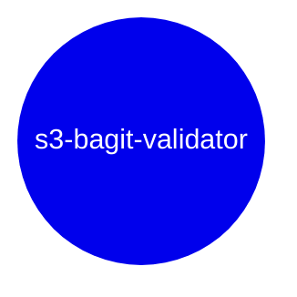

# s3-bagit-validator

AWS Lambda to validate a [Bagit](https://www.ietf.org/rfc/rfc8493.txt) bag stored in S3.

## Development

- To preview a list of available Makefile commands: `make help`
- To install with dev dependencies: `make install`
- To update dependencies: `make update`
- To run unit tests: `make test`
- To lint the repo: `make lint`

### Running Locally with Docker

<https://docs.aws.amazon.com/lambda/latest/dg/images-test.html>

- Build the container:

```bash
docker build -t validator:latest .
```

- Run the default handler for the container:

```bash
docker run --env-file .env -p 9000:8080 validator:latest
```

- Post to the container:

```bash
curl -XPOST "http://localhost:9000/2015-03-31/functions/function/invocations" -d '{}'
```

- Observe output:

```
"You have successfully called this lambda!"
```

## Command Line Interface (CLI)

This application includes a CLI that is designed to invoke the deployed AWS Lambda.  This supports running AIP validation from a command line context, while still utilizing all the wiring and permissions of the deployed lambda.

To run CLI commands ensure the following environment variables are set:
```shell
WORKSPACE=### Environment "dev", "stage", or "prod"
AIP_VALIDATOR_ENDPOINT=### Deployed AWS Lambda endpoint URL.
CHALLENGE_SECRET=### Secret string that is passed as part of lambda invocation payload and checked before running.
```

Then run one of the following CLI commands:

### `pipenv run cli`
```text
Usage: -c [OPTIONS] COMMAND [ARGS]...

  S3 BagIt Validator CLI.

Options:
  -v, --verbose  Flag for verbose output.
  --help         Show this message and exit.

Commands:
  bulk-validate  Bulk validate AIPs stored in S3 via the AIP UUID or S3 URI.
  ping           Ping deployed AWS lambda, ensure connection and...
  validate       Validate a single AIP stored in S3 via the AIP UUID or...
```

### `pipenv run cli ping`
```text
Usage: -c ping [OPTIONS]

  Ping deployed AWS lambda, ensure connection and authorization.

Options:
  --help  Show this message and exit.
```

Example:

```shell
pipenv run cli ping
```

### `pipenv run cli validate`
```text
Usage: -c validate [OPTIONS]

  Validate a single AIP stored in S3 via the AIP UUID or S3 URI.

  The result is either 'OK' or the full validation response if the '--details'
  is set.

  Note: the timeout for the lambda HTTP request is quite long to accommodate
  AIPs that take substantial time to validate.  If there are connection issues
  it is recommended to use the 'ping' CLI command to ensure firewall access
  and authorization.

Options:
  -a, --aip-uuid TEXT  AIP UUID from Archivematica.
  -u, --s3-uri TEXT    Full S3 URI of AIP stored in S3.
  -d, --details        Return full AIP validation details as JSON to stdout
                       instead of 'OK'.
  --help               Show this message and exit.
```

### `pipenv run cli bulk-validate`
```text
Usage: -c bulk-validate [OPTIONS]

  Bulk validate AIPs stored in S3 via the AIP UUID or S3 URI.

Options:
  -i, --input-csv-filepath TEXT   Filepath of CSV with AIP UUIDs or S3 URIs to
                                  be validated.  [required]
  -o, --output-csv-filepath TEXT  Filepath of CSV for validation results.
  -d, --details                   Return full AIP validation details as JSON
                                  to stdout instead of 'OK'.
  -w, --max-workers INTEGER       Maximum number of concurrent validation
                                  workers.  This should not exceed the maximum
                                  concurrency for the deployed AWS Lambda
                                  function.
  --help                          Show this message and exit.
```

Examples:

```shell
# providing the AIP UUID
pipenv run cli --verbose validate --aip-uuid="c73d10a7-7cd2-406f-95b6-b12e8f2da646"

# providing the explicit S3 URI of the AIP
pipenv run cli --verbose validate --s3-uri="s3://my-bucket/c73d/10a7/7cd2/406f/95bf/b12e/8f2d/a646/my-amazing-aip-c73d10a7-7cd2-406f-95b6-b12e8f2da646"

# bulk validate against a list of AIPs in a CSV
pipenv run cli --verbose bulk-validate --input-csv-filepath="output/bulk-uuids.csv"
```


## Environment Variables

### Required

```shell
SENTRY_DSN=### If set to a valid Sentry DSN, enables Sentry exception monitoring. This is not needed for local development.
WORKSPACE=### Set to `dev` for local development, this will be set to `stage` and `prod` in those environments by Terraform.
CHALLENGE_SECRET=### Secret string that is passed as part of lambda invocation payload and checked before running
S3_INVENTORY_LOCATIONS=### Comma seperated list of S3 URIs that have S3 Inventory data for a particular bucket
```

### Optional

```shell
WARNING_ONLY_LOGGERS=### Optionally set "WARNING" logging level for comma seperated list of libraries; e.g. asyncio,botocore,urllib3,s3transfer,boto3
INTEGRATION_TEST_BUCKET=### [Integration tests] Bucket to use for integration testing
INTEGRATION_TEST_PREFIX=### [Integration tests] Prefix for any uploaded AIPs as part of integration testing
CHECKSUM_NUM_WORKERS=### Number of parallel threads to use for checksum generation / retrieval; default 256
AIP_VALIDATOR_ENDPOINT=### Deployed AWS Lambda endpoint URL; required for CLI commands
LAMBDA_MAX_CONCURRENCY=### Maximum number of parallel workers for CLI bulk validation.  This should not exceed the maximum concurrency of the deployed AWS Lambda.
```

## Related Assets

* Infrastructure: TODO



## Maintainers

* Team: [DataEng](https://github.com/orgs/MITLibraries/teams/dataeng)
* Last Maintenance: 2025-03